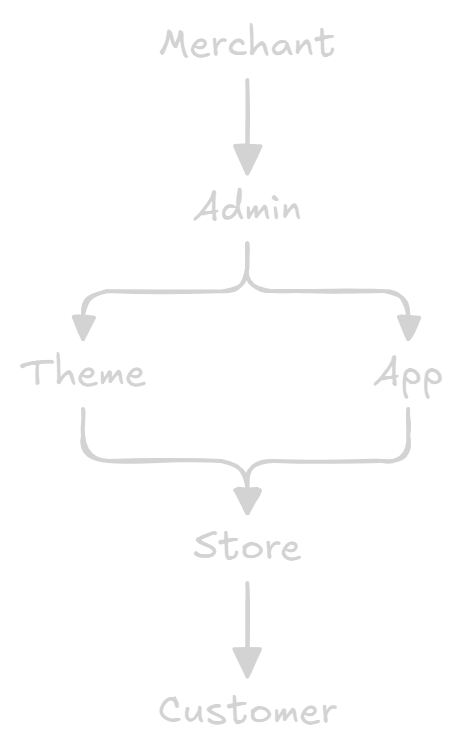

# Shopify 이해하기

로드맵 1일차의 학습 목표는 우선 Shopify가 무엇인지, 카페24나 NHN Shopby와 같은 기존 플랫폼과 어떤 차이가 있는지 이해하는 것에 중점을 두려고 한다.

## Shopify란 무엇인가?

Shopify는 기업과 판매자가 온라인 및 오프라인에서 상품을 판매하고, 주문·결제·재고·고객 관리 등을 하나의 플랫폼에서 운영할 수 있도록 지원하는 글로벌 커머스 플랫폼이다. 주문, 상품, 재고, 고객, 판매 채널 등을 하나의 관리자(Admin)에서 통합 관리할 수 있다.

카페24는 비교적 무료로 쇼핑몰을 시작할 수 있는 반면, Shopify는 기본적으로 월 구독료를 지불하는 SaaS 형태로 서비스를 이용한다. 이 점에서는 Shopby와 유사하다.

Shopify는 처음부터 글로벌 시장을 대상으로 설계된 플랫폼이기 때문에 다양한 국가의 결제 수단과 다국어, 다중 통화를 지원한다. 이 부분에서 카페24나 NHN Shopby와 같은 국내 플랫폼과 차별화된다. 예를 들어, Shopify에서는 한국에서만 사용되는 결제 수단인 카카오페이, 네이버페이, 토스페이 등은 지원하지 않지만, 글로벌 결제 수단인 PayPal, Stripe, Apple Pay 등은 지원한다.

가장 신기했던 부분은 온라인, 오프라인 상관없이 모든 상거래 활동을 하나의 플랫폼에서 관리할 수 있다는 점이었다. 예를 들어, 오프라인 매장에서 판매한 상품의 재고를 온라인 스토어에서 확인할 수 있고, 온라인 스토어에서 판매한 상품의 주문 내역을 오프라인 매장에서 확인할 수 있다.

## Shopify의 구성 요소

Shopify를 이해할 때 가장 중요한 것은 아래와 같은 4가지 구성 요소를 이해하는 것이다.

- 누가(Store를 운영하는 사람)
- 어디에서(Admin)
- 무엇을(Store)
- 어떻게 확장하는지(Theme, App, Extension)

전체적인 구조는 아래와 같다.

<figure align="center">
  
</figure>

### Merchant (판매자)

Merchant는 Shopify를 이용해 상품을 판매하는 **사업자 또는 브랜드**를 의미한다.

Shopify의 고객(Customer)이 아니라 **플랫폼을 사용하는 판매자**이며, Admin을 통해 상품 등록, 주문 관리, 재고 관리, 결제 및 배송 설정 등 쇼핑몰 운영에 필요한 대부분의 작업을 수행한다.

카페24나 NHN Shopby에서의 **쇼핑몰 운영자**나 **관리자**와 같은 개념으로 이해하면 조금 더 쉽다.

### Customer (고객)

Customer는 Shopify Store에서 실제로 상품을 구매하는 **최종 사용자**이다.

즉, 커머스 플랫폼을 이용하는 실제 고객층을 가리킨다. 고객은 상품을 탐색하고 장바구니에 담아 결제를 진행하며, 회원 가입 시 주문 내역이나 배송 정보 등을 확인할 수 있다.

개발자는 Customer 데이터를 활용하여 API를 통해 회원 기능, 마이페이지, 주문 조회, CRM 연동 등의 기능을 구현할 수 있다.

### Store

Store는 실제 고객이 접속하는 **온라인 쇼핑몰**이다.

상품, 컬렉션, 장바구니, 주문, 고객 정보 등이 하나의 Store 단위로 관리되며, 고객은 이 공간에서 상품을 탐색하고 구매한다.

Shopify에서는 하나의 Store 안에서 다양한 언어와 통화를 지원하여 글로벌 쇼핑몰을 운영할 수 있다. 예를 들어, 한국어와 영어를 동시에 지원하는 Store를 운영할 수 있으며, 고객은 자신의 언어와 통화에 맞게 상품을 탐색하고 결제할 수 있다.

### Admin

Admin은 쉽게 말해 **관리자 화면(Back Office)** 이다.

- 상품 등록 및 수정
- 주문 관리
- 고객 관리
- 재고 관리
- 배송 및 결제 설정
- Theme 관리
- App 설치 및 관리

위와 같은 작업을 수행할 수 있는데, Merchant가 Store를 운영하기 위한 모든 기능이 Admin에 모여 있다고 봐도 무방하다.

### Theme

Theme는 고객이 보는 **온라인 스토어의 화면(UI)** 을 구성하는 템플릿이다.

상품 목록, 상품 상세 페이지, 장바구니, 블로그 등 Store의 프론트엔드를 담당하며, 디자인과 사용자 경험(UX)을 결정한다.

카페24의 **스킨**과 비슷한 개념이라고 이해하면 된다. 다만, Shopify는 **Liquid**, **Sections**, **Blocks** 구조를 사용하여 관리자가 손쉽게 화면을 구성하고 수정할 수 있도록 설계되어 있다.

### App

App은 Shopify의 기본 기능을 **확장**하거나 외부 서비스와 **연동**하기 위한 애플리케이션이다.

예를 들어 다음과 같은 기능을 App으로 제공할 수 있다.

- 리뷰 기능
- 멤버십 및 적립금
- ERP 연동
- WMS/OMS 연동
- 마케팅 및 CRM 연동

즉, Theme가 화면을 담당한다면 App은 **기능을 담당한다**고 이해하면 쉽다.

### Extension

Extension은 App의 기능을 Shopify의 특정 위치에 연결하는 **확장 포인트**이다.

- 상품 상세 페이지에 리뷰 위젯 추가
- Checkout 화면에 안내 문구 추가
- Admin 주문 상세 페이지에 물류 정보 표시

위와 같은 동작들처럼, App이 Shopify 내부에서 동작하도록 연결해주는 역할을 한다. 쉽게 말해 **App이 하나의 프로그램이라면, Extension은 그 프로그램이 Shopify 안에서 동작할 위치를 결정하는 방식**이라고 이해하면 된다.

### 요약

- **Merchant:** 쇼핑몰을 운영하는 판매자
- **Customer:** 상품을 구매하는 고객
- **Store:** 고객이 이용하는 온라인 쇼핑몰
- **Admin:** 판매자가 Store를 관리하는 관리자 화면
- **Theme:** Store의 화면(UI)과 디자인을 담당
- **App:** Shopify의 기능을 확장하는 애플리케이션
- **Extension:** App을 Shopify 내부에 연결하는 확장 방식

---

## 참고

- [Shopify란 무엇인가요?](https://www.shopify.com/kr/blog/what-is-shopify)
- [Shopify Developers](https://shopify.dev/docs)
- [Themes](https://shopify.dev/docs/themes)
- [Apps](https://shopify.dev/docs/apps)
- [App Surfaces](https://shopify.dev/docs/apps/build/app-surfaces)
